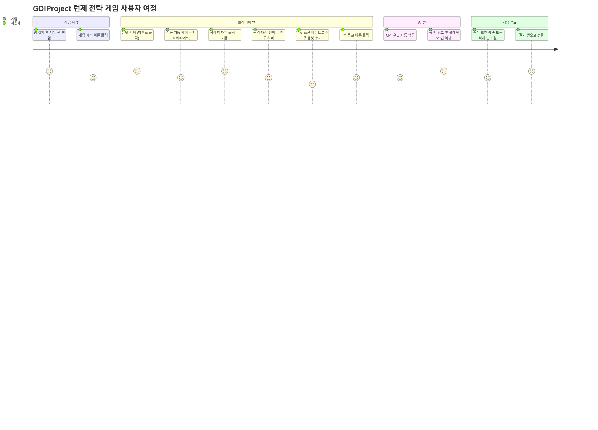
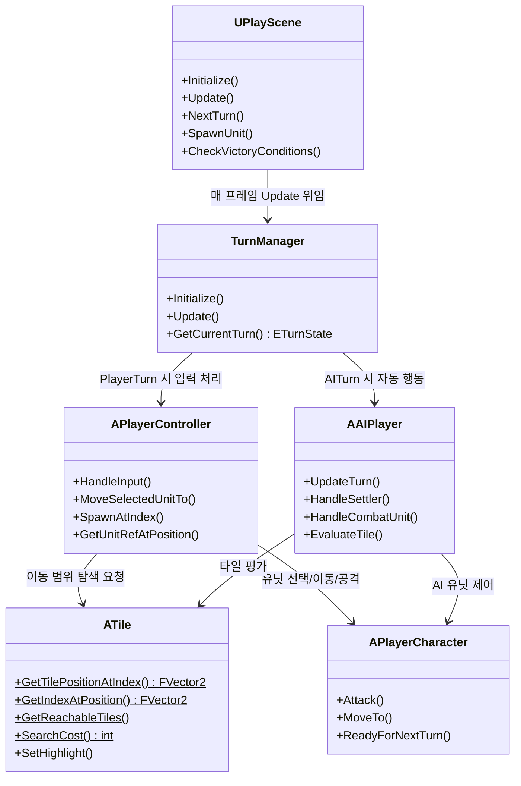
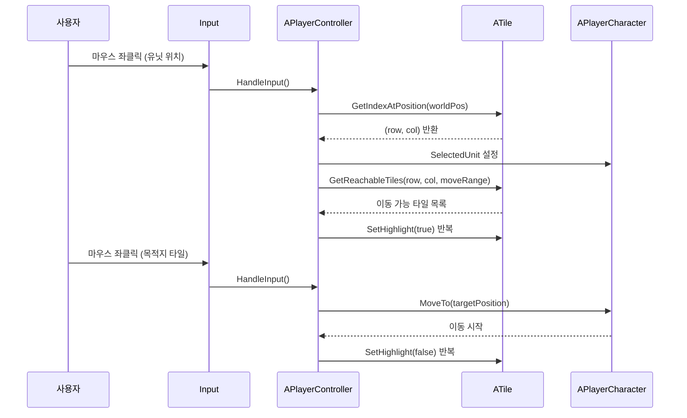
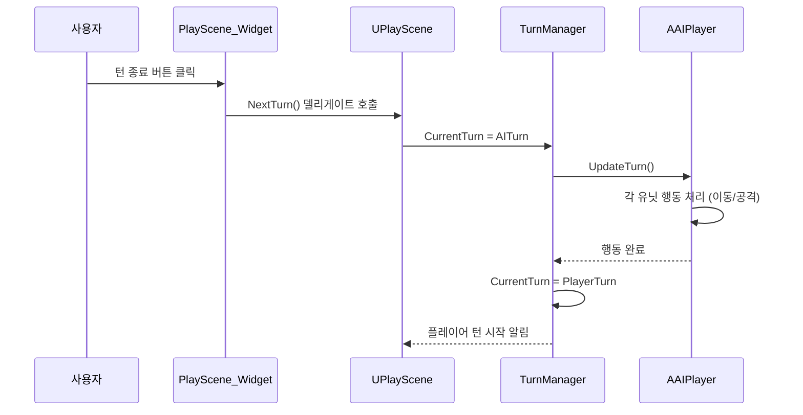

# GDI 턴제 전략 게임 (GDIProject)

> 자체 GDI+ 엔진 위에서 구현한 턴제 전략 게임입니다.  
> 헥사곤 타일 맵, 유닛 관리, BFS 이동 경로 탐색, AI 플레이어, 카메라 줌까지 엔진 계층과 게임 로직을 직접 나누어 구현했습니다.

## Project Snapshot

| 항목 | 내용 |
|---|---|
| 프로젝트 유형 | 개인 프로젝트 (학습) |
| 내 역할 | 엔진 구조 설계 · 게임 로직 전체 구현 |
| 플랫폼 | Windows (Win32, GDI+) |
| 기술 스택 | `C++` `GDI+` `Win32 API` |
| 핵심 기여 | 헥사곤 타일 맵 및 BFS 이동 범위 탐색 · 턴제 플레이어/AI 교대 구조 · GDI+ 렌더러 · 카메라 줌 인/아웃 |

---

# 왜 만들었나

GDI 프로그래밍을 배우면서 단순한 예제가 아닌, 실제로 동작하는 게임 구조를 직접 구현해 보고 싶었습니다.  
상용 엔진이나 라이브러리의 도움 없이 C++와 GDI+만으로 게임 오브젝트 수명 관리, 씬 전환, 렌더링, 입력 처리, AI 판단까지 직접 설계하면서 엔진이 어떻게 동작하는지 내부부터 파악하는 것이 목적이었습니다.

---

# 사용자는 무엇을 할 수 있는가

## 1. 헥사곤 타일 위에서 유닛을 이동시킨다

플레이어는 마우스 클릭으로 유닛을 선택하고, 이동 가능한 타일을 확인한 뒤 목적지를 클릭해 이동시킵니다.

- 입력 데이터: 마우스 클릭 위치
- 처리 방식: 월드 좌표 → 타일 인덱스 변환 후 BFS로 이동 가능 범위 계산, 타일 이동 비용(지형 종류별 상이) 반영
- 결과: 이동 가능 타일 하이라이트 표시 및 유닛 이동
- 옵션: 유닛 종류별 이동 범위 차이 (Settler/Warrior/Archer)

## 2. 유닛을 생산하고 관리한다

화면 하단 UI 버튼으로 도시에서 유닛을 소환하고, 턴마다 행동 횟수를 관리합니다.

- 입력 데이터: 유닛 소환 버튼 클릭
- 처리 방식: 도시(City) 위치에 유닛 스폰, 액션 카운트 초기화
- 결과: 유닛이 타일에 배치됨
- 옵션: Settler(정착자) / Warrior(전사) / Archer(궁수) 중 선택

## 3. 마우스 휠로 카메라를 줌 인/아웃한다

전체 지도를 한눈에 보거나 세부 타일을 가까이 보고 싶을 때 마우스 휠로 시점을 조절합니다.

- 입력 데이터: 마우스 휠 델타
- 처리 방식: 카메라 스케일 0.3x ~ 4.0x 범위 내 조정
- 결과: GDI+ 렌더러가 카메라 스케일을 반영해 화면 재구성

---

# 개발 중 만난 문제와 해결

## 1. 헥사곤 타일 좌표 변환

- **문제 상황**  
  헥사곤 타일은 짝수 행과 홀수 행의 이웃 타일 오프셋이 다릅니다. 픽셀 좌표를 타일 인덱스로 변환하고, 인접 타일을 순회하는 로직이 행 짝홀수에 따라 분기해야 해서 계산 실수가 잦았습니다.

- **해결**  
  `even_dy/dx`, `odd_dy/dx` 방향 배열을 분리해 선언하고, 인덱스 유효성 검증 함수 `IsValidIndex`를 별도로 두었습니다.  
  `GetTilePositionAtIndex`, `GetIndexAtPosition`을 정적 함수로 분리해 변환 로직을 한 곳에서만 유지하도록 했습니다.

- **설계 판단**  
  좌표 변환을 게임 로직 곳곳에 인라인으로 두면 수정 시 모든 위치를 바꿔야 합니다. 정적 유틸리티 함수로 분리해 호출하는 쪽은 변환 방식을 신경 쓰지 않아도 되게 구성했습니다.

## 2. 이동 가능 범위 탐색 성능

- **문제 상황**  
  유닛을 선택할 때마다 전체 타일을 순회하며 이동 가능 여부를 판단하면, 타일 수가 늘어날수록 연산이 많아졌습니다.

- **해결**  
  BFS 기반 `GetReachableTiles` 함수를 구현해 이동 비용(타일 지형별 Cost)을 누적하며 도달 가능한 타일만 탐색하도록 했습니다.

- **설계 판단**  
  이동 비용은 지형 종류에 따라 다르게 설정했습니다(사막은 고비용, 초원은 저비용). `GetTileMoveCost`를 타일 클래스 내부에 두어 비용 규칙이 타일 자체에 귀속되게 했습니다.

## 3. 플레이어/AI 턴 교대 상태 관리

- **문제 상황**  
  플레이어 턴이 끝난 뒤 AI 턴으로 전환되는 과정에서, AI 처리 중 플레이어 입력이 함께 처리되는 상황이 발생했습니다.

- **해결**  
  `TurnManager`에 `ETurnState::PlayerTurn / AITurn` 열거형 상태를 두고, AI 턴 중에는 플레이어 입력을 무시하도록 분기를 구성했습니다.

- **설계 판단**  
  턴 상태를 `TurnManager` 한 곳에서 관리하고, `PlayerController`와 `AIPlayer` 모두 이 상태를 참조하게 해 어디서 입력을 막을지 명확하게 만들었습니다.

## 4. 엔진 계층과 게임 계층 분리

- **문제 상황**  
  게임 오브젝트를 생성하고 씬에서 관리할 때, 렌더러와 게임 로직이 같은 코드 안에 섞이면 수정 범위를 예측하기 어려웠습니다.

- **해결**  
  Engine 프로젝트와 Games 프로젝트를 별도 모듈로 나누었습니다. Engine에는 Renderer, Animation, Input, Math, Time 등 공통 기반을 두고, Games에는 씬별 로직과 유닛·타일·UI만 두었습니다.

- **설계 판단**  
  `NewObject<T>`, `Cast<T>`, `weak_ptr` 기반 참조 관리를 Engine 계층에서 제공해, Games 계층에서는 오브젝트 생성·소유권 처리에 일관된 방법을 사용하도록 했습니다.

---

# 핵심 기능 하이라이트

## BFS 이동 범위 + 타일 하이라이트

**무엇을 하는 기능인가**  
유닛 선택 시 이동 가능한 헥사곤 타일들을 BFS로 탐색하고, 해당 타일에 하이라이트를 표시합니다.

**왜 필요했나**  
플레이어가 어디로 이동할 수 있는지 직관적으로 알 수 없으면 타일 전략 게임의 핵심 조작이 동작하지 않습니다.

**어떻게 구현했나**  
`ATile::GetReachableTiles`에서 시작 타일부터 BFS를 수행하며, 각 타일의 `GetTileMoveCost`를 누적해 유닛의 이동 범위 안에 드는 타일을 수집합니다. 수집된 타일에 `SetHighlight(true)`를 호출해 렌더러가 강조 이미지를 그리도록 합니다.

**사용자에게 보이는 결과**  
선택한 유닛이 도달할 수 있는 타일이 하이라이트되고, 목적지 클릭 시 이동이 시작됩니다.

## TurnManager 기반 플레이어/AI 교대

**무엇을 하는 기능인가**  
플레이어가 "턴 종료" 버튼을 누르면 AI 턴이 시작되고, AI가 모든 유닛 행동을 완료하면 다시 플레이어 턴으로 돌아옵니다.

**왜 필요했나**  
턴제 전략 게임에서 플레이어와 AI가 동시에 행동하면 게임 규칙이 무너집니다.

**어떻게 구현했나**  
`TurnManager::Update()`에서 현재 상태를 확인해 `PlayerTurn`이면 `PlayerController::HandleInput()`을, `AITurn`이면 `AAIPlayer::UpdateTurn()`을 호출합니다. AI는 Settler는 좋은 타일을 찾아 이동시키고, 전투 유닛은 가장 가까운 적을 향해 이동·공격합니다.

**사용자에게 보이는 결과**  
플레이어 턴 종료 후 AI가 자동으로 행동하고, 완료되면 다음 플레이어 턴이 시작됩니다.

---

# 사용자 관점의 사용 흐름

---

# 어떻게 만들었나

## 1. Engine Layer

렌더링·애니메이션·입력·수학·시간을 담당하는 공통 기반 계층입니다.

- GDI+ 기반 `Renderer`: 이미지·텍스트·UI·캐릭터 애니메이션 렌더링, 카메라 변환 적용
- `AnimationComponent`: 스프라이트 시트 기반 프레임 애니메이션
- `Input`: Win32 키/마우스 상태 관리
- `Math` / `Time`: 벡터 연산, 프레임 시간 계산

## 2. Game Framework Layer

씬·오브젝트·게임 상태를 관리하는 계층입니다.

- `UScene` 상속 구조: `MenuScene` / `PlayScene` / `EndScene` / `WinScene`
- `UObject` / `AActor` / `ACharacter` / `APawn` 계층으로 오브젝트 역할 분리
- `GameStateBase`: 카메라·씬 전환 상태 유지
- `NewObject<T>` / `Cast<T>`: 오브젝트 생성·다운캐스트 통일

## 3. Game Logic Layer

게임 규칙·전투·AI를 처리하는 계층입니다.

- `TurnManager`: 플레이어/AI 턴 교대, 유닛 행동 횟수 관리
- `APlayerController`: 유닛 선택·이동·소환, 마우스 입력 처리
- `AAIPlayer`: 정착자·전투 유닛 자동 행동 로직
- `ATile`: 헥사곤 좌표 변환, BFS 이동 범위 탐색, 지형별 이동 비용

## 4. UI Layer

화면에 정보를 표시하는 계층입니다.

- `UPlayScene_Widget`: 유닛 소환 버튼, 턴 종료·스킵 버튼
- `SUIButtonComponent`: 버튼 클릭 → 델리게이트 콜백 연결
- `UCharacterNameWidget`: 유닛 이름 표시

---

# 전체 구조 클래스 다이어그램

---

# 주요 기능 시퀀스 다이어그램

## 1. 유닛 이동 실행 흐름

이 다이어그램은 플레이어가 유닛을 클릭하고 목적지까지 이동시키는 흐름을 보여줍니다.

## 2. 턴 교대 흐름

이 다이어그램은 플레이어 턴이 끝나고 AI 턴으로 전환되는 흐름을 보여줍니다.

---

# Before / After

| 구분 | 기존 방식 | 개선 후 |
|---|---|---|
| 이동 범위 탐색 | 전체 타일 순회 | BFS + 이동 비용 누적으로 도달 가능 타일만 탐색 |
| 좌표 변환 | 로직 곳곳에 인라인 분산 | ATile 정적 함수로 통합 |
| 턴 상태 | 플레이어/AI 입력 혼재 가능 | TurnManager로 상태 단일 관리 |
| 레이어 분리 | 렌더러와 게임 로직 혼재 | Engine / Games 프로젝트로 명확히 분리 |

---

# 개선하면서 배운 점

헥사곤 좌표계처럼 간단해 보이는 수학도 코드 곳곳에 퍼지면 수정 비용이 커진다는 점을 배웠습니다.  
변환 로직을 한 곳에 모으고 나서야 버그를 고칠 때 파일 하나만 열면 됐습니다.

또한 Turn 상태처럼 여러 시스템이 참조하는 정보는 한 곳에서만 바꿀 수 있어야 오작동을 추적하기 쉽다는 점도 직접 경험했습니다.

---

# 추후 보강할 내용

- 실제 게임 플레이 화면 이미지 / GIF
- 타일 하이라이트 및 유닛 이동 GIF
- AI 행동 장면 스크린샷
- 프로젝트 개발 기간
